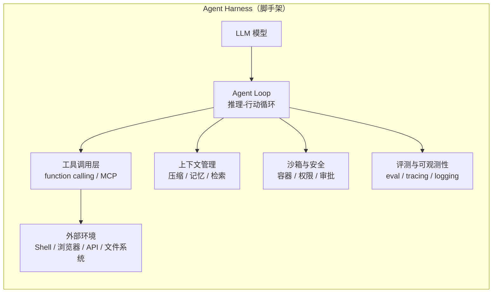

# 核心概念：什么是 Agent Harness？

## 1. 定义

**Agent Harness（智能体脚手架）** 指 LLM 模型之外、把一个模型变成"能干活的智能体"所需的
全部工程组件。对比关系：

| | 模型（Model） | Harness（脚手架） |
|---|---|---|
| 是什么 | 参数化的神经网络（如 GPT、Claude、DeepSeek） | 模型周围的一切工程：循环、工具、上下文、沙箱、评测 |
| 决定什么 | 推理能力的上限 | 能力转化为实际任务表现的效率 |
| 例子 | LLM 本身 | agent loop、function calling 协议、MCP、sandbox、eval |

典型 Harness 形态：终端编码 agent（Claude Code / Aider）、SWE-bench 系统（OpenHands）、
agent 编排框架（LangGraph / CrewAI）、agent SDK（OpenAI Agents SDK / Google ADK）。

## 2. 核心组件

- **Agent Loop（智能体循环）**：`思考 → 决定行动 → 执行 → 观察结果 → 再思考` 的主循环，是 harness 的心脏。
- **工具调用（Tool / Function Calling）**：模型以结构化格式（JSON schema）声明要调用的函数，
  由 harness 执行并回传结果。MCP 将其标准化。
- **上下文管理（Context Engineering）**：窗口有限，需要压缩历史、注入相关信息、管理记忆。
- **沙箱与安全（Sandbox & Security）**：agent 在隔离环境（Docker 容器、受限权限、人工审批）中执行，
  防止破坏真实系统。
- **评测与可观测性（Eval & Observability）**：没有评测就无法改进——benchmark（SWE-bench 等）、
  tracing、日志都是 harness 的组成部分。

## 3. 主流设计模式

1. **ReAct（推理-行动循环）**：模型交替输出推理链与行动，观察结果后继续。
   [ReAct 论文](https://arxiv.org/abs/2210.03629) 是最基础的模式。
2. **Plan-and-Execute（先规划后执行）**：先生成完整计划，再逐步执行、按需修正计划。
3. **CodeAct（代码即行动）**：不输出 JSON 动作，而是直接写/执行 Python 代码，
   表达力远超固定动作集（smolagents、OpenHands 的思路）。
4. **Multi-agent 编排（多智能体协作）**：
   - Orchestrator-Worker：一个"主管"agent 分解任务分派给多个"工人"agent；
   - Handoff（移交）：agent 之间按能力移交对话（OpenAI Agents SDK 的核心概念）；
   - Swarm（蜂群）：大量轻量 agent 按角色动态组合。

## 4. 为什么值得研究

- **榜单差距的来源**：SWE-bench 上高分系统（OpenHands ~60%+）与裸模型（~5%）的差距，
  几乎全部来自 harness（脚手架 + 工具 + 评测循环）而非模型本身。
- **复现与工程化**：harness 决定系统能否稳定、安全、可观测地运行。
- **研究前沿**：MCP 标准化、agent 评测方法、长任务可靠性、多 agent 编排都是活跃方向。

## 5. 推荐阅读顺序

1. [Anthropic: Building Effective Agents](https://www.anthropic.com/research/building-effective-agents)（20 分钟，必读）
2. ReAct 论文（30 分钟）
3. [OpenAI: A Practical Guide to Building Agents](https://openai.com/business/guides-and-resources/a-practical-guide-to-building-ai-agents/)
4. 挑一个框架动手：smolagents（最小）→ LangGraph 或 OpenAI Agents SDK（完整）
