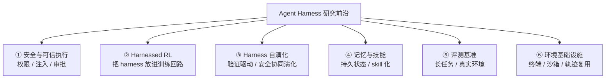

# 研究前沿：agent harness 正在解决什么问题

> 本文由 [每周论文精选](../papers/README.md) 的实际收录内容归纳而成（2026-08 ~ 2026-09）。
> 每个方向都给了代表性论文链接，建议按兴趣挑 2-3 篇精读。

## 全景：harness 研究从"能不能用"转向"能不能信"

2026 年下半年的 arXiv 投稿显示，agent harness 研究已经从"搭出一个能跑的循环"，
转向四个更工程化的问题：**安全可控、可被训练、能自我演化、能被度量**。

## ① 安全与可信执行：当前最热的方向

核心问题：**agent 的输出会变成指令，工具输出会被当成命令**——这条链路上任何一环失守，
harness 就从助手变成攻击面。

| 论文 | 关注点 |
|------|--------|
| [When Context Gets Root: Privilege Escalation in LLM Harnesses](https://arxiv.org/abs/2608.27299) | 上下文本身成为提权途径 |
| [When Tool Outputs Become Commands](https://arxiv.org/abs/2608.27146) | 把"动作诱导"与"运行时授权"分离 |
| [The Framing Gap: Indirect Prompt-Injection Exfiltration](https://arxiv.org/abs/2608.27092) | 间接提示注入绕过表层防御 |
| [A Blind Trust, the Bloody Thrust](https://arxiv.org/abs/2609.03884) | 攻击者控制的 hook 更新操纵 harness 行为 |
| [Safety Does Not Compose](https://arxiv.org/abs/2608.27141) | 逐轮安全不等于长循环安全（非衰减循环状态） |
| [SPA: Plan-First Information-Flow Control](https://arxiv.org/abs/2608.27234) | 跨查询持久 agent 的信息流控制 |
| [Task-Conditioned Least-Privilege Learning](https://arxiv.org/abs/2608.18351) | 终端与 MCP agent 的最小权限化 |
| [ACLE-MCP: Attested Capability Leases](https://arxiv.org/abs/2609.02690) | 远程工具调用的执行期信任租约 |
| [When Agents Act on Web3](https://arxiv.org/abs/2608.17275) | MCP / Skills / tool calling 的攻击面综述 |
| [HarnessRisk](https://arxiv.org/abs/2608.17597) | harness 安全的**全生命周期基准**（评测而非单点防御） |

**给实践者的启示**：别只做"输入过滤"，要按最小权限设计工具的 action space，
并把工具输出当作不可信输入处理。

## ② Harnessed RL：把 harness 放进训练回路

过去 RL 训练与 agent 框架是两套东西；现在的趋势是**直接在真实 harness 上训练**，
让模型学会在长循环、多工具的环境里做决策。

| 论文 | 关注点 |
|------|--------|
| [Agent Lightning v1.0: Towards Harnessed Agentic RL](https://arxiv.org/abs/2608.17528) | 明确提出"harnessed agentic RL" |
| [LEGO-RL: Harness-Native RL for Coding Agents](https://arxiv.org/abs/2608.17393) | harness 原生（而非外挂）的 RL |
| [RTPO: Reverse-Turn Policy Optimization](https://arxiv.org/abs/2608.18682) | 多轮 RL 训练不稳定的三大根因与解法 |
| [TIGPO: Temporal Instance-Graph Policy Optimization](https://arxiv.org/abs/2609.03383) | 长任务 agent 的策略优化 |
| [DRACO: Dynamic Rubrics for Long-Horizon Training](https://arxiv.org/abs/2609.04094) | 长任务中的细粒度信用分配 |
| [GRAIN](https://arxiv.org/abs/2608.27142) | 带不变性奖励的 agentic RL |

**关键难点**：多轮 rollout 的信用分配（哪一步的决策导致了最终成败）、训练-推理上下文不匹配、
长轨迹导致的策略漂移。

## ③ Harness 的自演化

Harness 不再由人手写死，而是**根据行为证据自动演化**——但要避免"越演化越不安全"。

| 论文 | 关注点 |
|------|--------|
| [Verify Smarter, Evolve Further](https://arxiv.org/abs/2608.27311) | 用行为感知验证来高效演化 harness |
| [SafeEvolve: Harness-Policy Co-Evolution](https://arxiv.org/abs/2609.02786) | harness 与策略协同演化中的安全性 |
| [What Do CAE Simulation Agents Really Need Beyond a Generic Harness?](https://arxiv.org/abs/2609.03718) | 通用 harness 之外还需要什么（领域适配） |
| [SemaPLC: Verification-Gated Agent Harness](https://arxiv.org/abs/2608.18565) | **只有外部检查通过才算完成**的门控式 harness |

**SemaPLC 的思路值得记住**：不信任模型自评"我做完了"，而是用编译 + 静态 + 运行时的外部检查
作为完成条件——在动态行为层拉开 22.4→52.2 的巨大差距。

## ④ 记忆与技能：agent 的持久状态

长任务 agent 的瓶颈从"上下文窗口"变成了"什么该记住、什么该忘、技能如何沉淀"。

| 论文 | 关注点 |
|------|--------|
| [SPT: Skills as Pre-Training Data](https://arxiv.org/abs/2608.26563) | 把技能当作预训练数据 |
| [WikiSkill: Compiling Agent Experience into Persistent Knowledge](https://arxiv.org/abs/2608.27454) | 经验编译成持久知识 |
| [CHIME: Credit-Aware Hierarchical Memory Evolution](https://arxiv.org/abs/2609.02074) | 面向长任务的记忆演化 |
| [SimSkill](https://arxiv.org/abs/2609.03753) | 终身学习型 agent 的技能掌握 |

## ⑤ 评测基准：从"单轮问答"到"真实长任务"

近期基准的共同特征：**长时程（long-horizon）、真实工具、可复现**。

| 基准 | 评测对象 |
|------|---------|
| [HarnessRisk](https://arxiv.org/abs/2608.17597) | harness 安全全生命周期 |
| [Terminal-Universe](https://arxiv.org/abs/2609.04148) | 把 agent 轨迹复现成可扩展终端环境 |
| [Environment Evolution for Terminal Agents](https://arxiv.org/abs/2609.04128) | 终端 agent 的环境演化 |
| [PatchBench](https://arxiv.org/abs/2609.04075) | 漏洞修补能力 |
| [CivBench](https://arxiv.org/abs/2609.02459) | 游戏环境中的长时程工具使用 |
| [TraceBench](https://arxiv.org/abs/2608.27182) | 时间序列根因归因 |

## ⑥ 环境与沙箱基础设施

Terminal-Universe、Environment Evolution 这类工作说明：**环境本身就是 harness 的一部分**，
可复现的环境是评测与训练的共同前提。

## 📌 怎么用这份文档

1. **入门**：先读 [concepts.md](concepts.md) 建立框架，再看本文的 ①（安全）——这是当前最活跃、
   也最容易踩坑的方向。
2. **动手**：如果你是工程师，② 的 SemaPLC"验证门控"思路可以直接用在你的 agent 完成条件上；
   ① 的"工具输出不可信"是最低成本的安全改进。
3. **跟进**：每周日看 [papers/README.md](../papers/README.md) 的自动更新，上面这些方向
   基本每周都有新论文进出。
